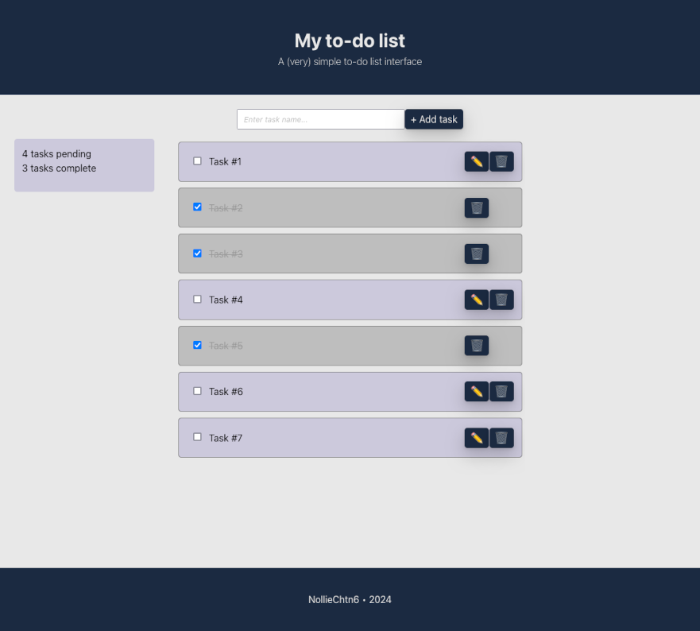

# Basic To-Do List Interface

## :clipboard: Project Overview

This project is a simple to-do list application built with React. The main objective of the project was to learn how to use React state to create, update, and delete tasks in the interface.

:warning: Please note that the application DOES NOT include any persistence mechanism, meaning the tasks are not saved when the page is refreshed or closed.



## :sparkles: Features

- Simple Interface: the user interface is designed to be very simple and easy to use.
- Add New Tasks: users can add new tasks using the form provided.
- Update Tasks: tasks can be marked as complete or pending, and their details can be updated.
- Delete Tasks: users can remove tasks from the list.
- Tasks Counter: the application includes a counter that displays the number of pending and completed tasks.

## :wrench: Technologies Used

- React
- TypeScript
- SCSS

## :rocket: How to run the project?

1) Clone the repository.
2) Install dependencies by running the following command:

```bash
npm install
```

3) Start the development server:

```bash
npm run dev
```

The application will be available at http://localhost:3173.

4) Enjoy :smile:.